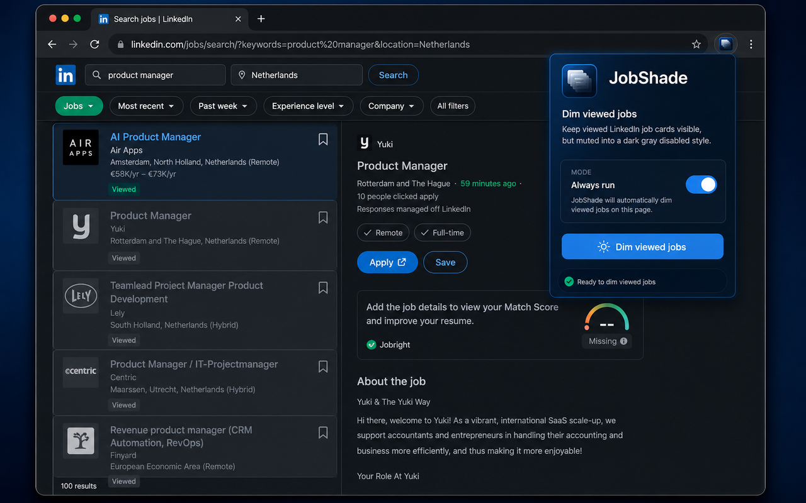
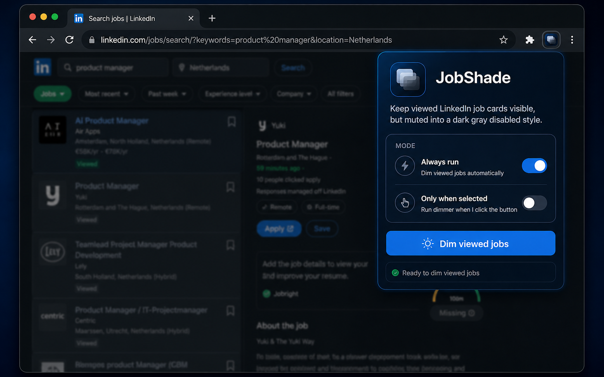

# LinkedIn Viewed Job Dimmer

LinkedIn Viewed Job Dimmer dims viewed LinkedIn job cards in place and highlights saved keyword groups in the main job description.

## What it does

- Detects job cards in `li[data-occludable-job-id]`
- Finds cards whose footer state says `Viewed`
- Keeps the cards visible, but mutes them into a dark gray disabled style
- Highlights saved keyword groups in the main JD with 10 preset colors
- Supports multiple keyword sets in the popup editor
- Watches the page so newly loaded viewed jobs and JD content stay in sync
- Supports `Always run` and `Only when selected`
- Saves your mode and keyword groups locally so they survive popup closes and page reloads

## Screenshots

## Install

1. Open `chrome://extensions`
2. Enable `Developer mode`
3. Click `Load unpacked`
4. Select this folder
5. Reload the LinkedIn jobs tab after installing

## Use

- Open a live LinkedIn jobs search page
- Click the LinkedIn Viewed Job Dimmer extension icon
- Choose `Always run` if you want automatic dimming
- Add one or more keyword sets in the popup, then pick a preset color for each set
- Click `Save and highlight` to apply the keyword groups to the current job description
- Otherwise leave `Only when selected` on and click `Dim viewed jobs` when needed

## Publishing Kit

- Store listing copy: [`docs/chrome-web-store-listing.md`](docs/chrome-web-store-listing.md)
- Privacy policy text: [`docs/privacy-policy.md`](docs/privacy-policy.md)
- Privacy policy page to host: [`docs/privacy.html`](docs/privacy.html)
- Icon: [`assets/icons/icon-128.png`](assets/icons/icon-128.png)
- Promo image 1: [`assets/store/linkedin-viewed-job-dimmer-promo-1.png`](assets/store/linkedin-viewed-job-dimmer-promo-1.png)
- Promo image 2: [`assets/store/linkedin-viewed-job-dimmer-promo-2.png`](assets/store/linkedin-viewed-job-dimmer-promo-2.png)

## Notes

- The extension runs on live LinkedIn jobs pages, not on saved HTML snapshots opened from disk
- If LinkedIn opens as `linkedin.com` instead of `www.linkedin.com`, the extension still matches it
- The extension stores the run mode and keyword groups locally in Chrome extension storage
